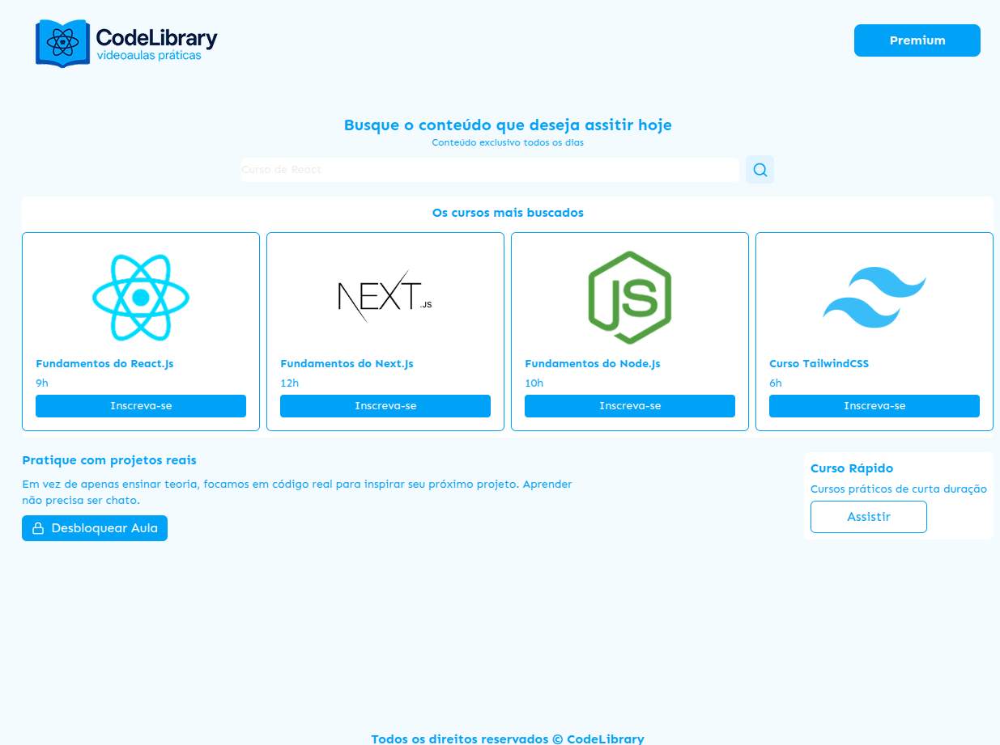
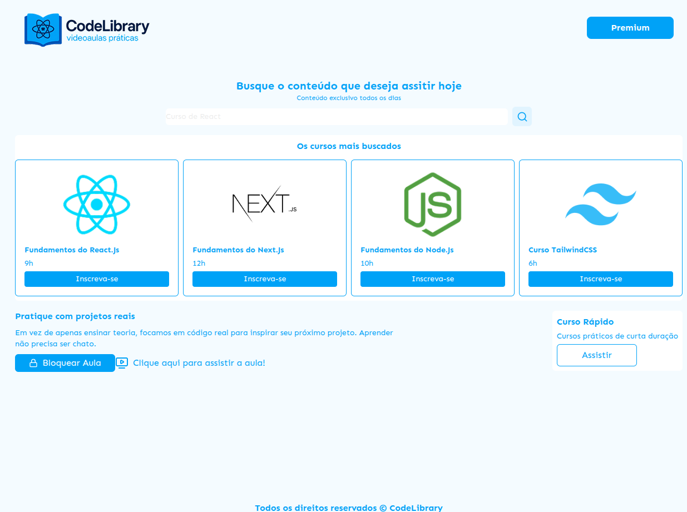

# 💻 React User Management App

Uma aplicação web desenvolvida do zero para consolidar os fundamentos do ecossistema React moderno, utilizando TypeScript, Vite e Tailwind CSS.

## 📸 Demonstração

_(Adicione os prints do seu projeto abaixo)_


_Legenda: Visão geral da interface._


_Legenda: Demonstração da renderização condicional e estado._

### 📋 Resumo do Projeto e Tópicos Aprendidos

Este projeto foi desenvolvido como uma aplicação prática para consolidar os fundamentos do **React com TypeScript**, construindo uma interface do zero e aplicando conceitos modernos de desenvolvimento frontend.

#### 🛠️ Ferramentas e Setup

- **Node.js e NPM:** Utilização do ecossistema Node para gerenciar pacotes e rodar o servidor de desenvolvimento local.
- **Vite:** Inicialização do projeto utilizando Vite (`npm create vite@latest`), escolhido por ser uma ferramenta mais enxuta e rápida do que o antigo Create React App.
- **TypeScript:** Configuração do projeto com TypeScript em vez de JavaScript puro (`.tsx`), garantindo tipagem estática e maior segurança no código.

#### 🏗️ Arquitetura e Fundamentos do React

- **Single Page Application (SPA):** Entendimento de como o React renderiza a aplicação inteira dinamicamente dentro de uma única `div root` (`index.html`), sem precisar recarregar a página no navegador.
- **Componentização:** Divisão da interface em partes pequenas e reutilizáveis (como peças de Lego), criando arquivos `.tsx` independentes (ex: `Header`, `Footer`, `Card`, `Filter`).
- **JSX/TSX:** Uso da sintaxe que permite escrever HTML e JavaScript/TypeScript juntos no mesmo arquivo.

#### 🎨 Estilização e Design

- **CSS Global vs. Local:** Uso do `className` (em vez de `class`) para evitar conflitos com o HTML padrão e entendimento de como a importação de CSS funciona no React.
- **Tailwind CSS:** Instalação e configuração completa do framework Tailwind para estilização rápida por meio de classes utilitárias.
- **Layouts Responsivos:** Aplicação de conceitos de Flexbox (`flex-col`, `justify-between`, `items-center`) e CSS Grid (`grid-cols-4`, `grid-cols-5`) diretamente com Tailwind.
- **Recursos Externos:** Integração de fontes personalizadas via Google Fonts e uso da biblioteca `lucide-react` para inserção de ícones dinâmicos.

#### 🔄 Dinamismo com Props (Propriedades)

- **Passagem de Props:** Construção de componentes dinâmicos que recebem dados (como `title`, `placeholder` e imagens), permitindo reutilizar o mesmo layout do componente (ex: Cards) com informações diferentes.
- **Tipagem com TypeScript:** Criação de `types` (ex: `type CardProps = {...}`) para definir exatamente quais dados um componente deve receber e quais são os seus tipos (`string`, etc.).
- **Desestruturação e Props Opcionais:** Uso de desestruturação para tornar o código mais limpo (`{ title, placeholder }`) e definição de propriedades opcionais utilizando o operador `?` no TypeScript.

#### ⚡ Reatividade e Gerenciamento de Estado

- **O Conceito de Reatividade:** Entendimento prático de que o React atualiza o DOM apenas onde os valores mudaram, diferente da manipulação manual do JavaScript Vanilla.
- **Hook `useState`:** Declaração de variáveis de estado (`const [valor, setValor] = useState(inicial)`) para armazenar dados que mudam com a interação do usuário e refletem imediatamente na interface.
- **Eventos:** Utilização do evento `onClick` em botões, disparando _arrow functions_ para atualizar variáveis de estado.
- **Renderização Condicional:** Uso de operadores lógicos (como ternários `condicao ? true : false` e short-circuits `&&`) para mostrar ou esconder elementos, como alterar o texto do botão de "Bloquear Aula" para "Desbloquear Aula" com base no estado.

---

## ⚙️ Como executar localmente

```
  cd learning-react
  npm install
  npm run dev
```

O servidor iniciará localmente. Acesse a porta indicada no terminal (geralmente http://localhost:5173).
